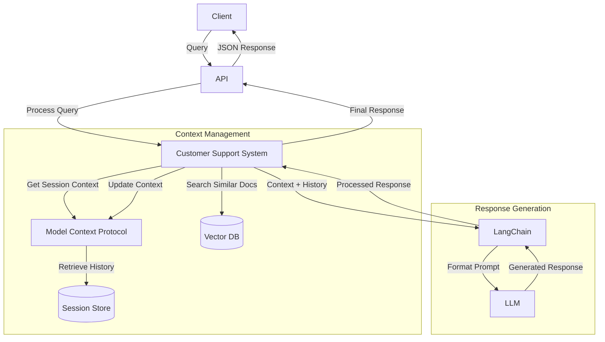

# intelligent-support-agent

An intelligent support automation agent-based system using Llama 2, Qdrant vector database, and LangChain. Provides context-aware responses by combining semantic search with conversation history. Built for customer support automation, locally deployable, and adaptable to various domains.

## Architecture

### Request Flow



### Component Details

1. **Vector Database (using Qdrant)**
   - Stores and indexes payment-related documentation
   - Enables semantic search for relevant content
   - Rust-based, open-source solution

2. **LLM (Llama 2 via Ollama)**
   - Generates contextual responses
   - Runs locally for data privacy and control
   - Open-source model

3. **Embeddings (sentence-transformers)**
   - Converts text into vector representations
   - Uses HuggingFace's sentence-transformers
   - Enables semantic similarity search

4. **Model Context Protocol (MCP)**
   - Manages conversation context
   - Handles user sessions
   - Maintains conversation history

5. **LangChain Integration**
   - Orchestrates the components
   - Manages prompt templates
   - Handles response generation

## Project Context

This project was born from specific challenges in automating customer support for an online trading platform. The complete context is documented in `context/problem-statement.md`, which outlines:

- **Target Environment**: Online Trading Platform (Deriv.com)
- **Primary Use Case**: Automating responses to payment-related customer queries
- **Core Business Context**: Handles online trading, deposits, and withdrawals

### Key Challenges

1. High volume of payment-related support queries
2. Need for consistent and accurate responses
3. Complex context tracking across customer interactions
4. Multiple payment methods and failure scenarios

### Technical Requirements

- Local development and testing capability
- Open-source tooling preference
- Containerized deployment
- Context-aware response generation

## Understanding the System

To make our system's architecture more approachable, we use an analogy (documented in `context/analogy.md`) that compares it to a team of specialized helpers:

- **Librarian (Vector Database)**: Quickly finds relevant documentation
- **Smart Helper (LLM)**: Reads and answers questions
- **Secretary (MCP)**: Remembers conversation history
- **Manager (LangChain)**: Coordinates everyone's efforts

This analogy helps developers and AI models understand how different components interact and their specific roles in the system.

### AI Model Context Files

The project includes two special files that help AI models (like LLMs) better understand and work with the system:

1. **context/problem-statement.md**
   - Provides clear business context and requirements
   - Helps AI models understand the purpose and scope
   - Enables more relevant code suggestions and improvements
   - Guides AI in maintaining project focus during development

2. **context/analogy.md**
   - Offers intuitive explanations of system components
   - Helps AI models generate more natural documentation
   - Provides consistent metaphors for explaining functionality
   - Makes technical concepts more approachable in AI-generated responses

> Note: These files serve as crucial context for human developers and AI assistants, ensuring consistent understanding and communication about the system's architecture and purpose.

## Project Structure

```
.
├── src/
│   ├── config.py               # Configuration settings
│   ├── main.py                 # FastAPI application
│   ├── vectorstore/            # Vector database integration
│   ├── mcp/                    # Model Context Protocol
│   └── llm_chain/              # LangChain integration
├── Dockerfile                  # Multi-stage build for the main app
├── Dockerfile.ollama           # Custom Ollama build with network utilities
├── Dockerfile.qdrant           # Custom Qdrant build with health check support
├── docker-compose.yml          # Container orchestration
├── requirements.txt            # Python dependencies
├── context                     # Project context to provide to GPT
│   ├── problem-statement.md    # Problem statement
│   └── analogy.md              # System explanation in easier language
```

### Container Customizations

1. **Main App Container (Dockerfile)**
   - Multi-stage build for optimized size
   - Includes curl for health checks
   - Runs as a non-root user for security

2. **Custom Ollama Container (Dockerfile.ollama)**
   - Based on ollama/ollama
   - Adds essential network utilities (curl, netcat, ping)
   - Required for proper health checks and diagnostics
   - Uses custom entrypoint to support both ollama and shell commands
   - We use a custom Dockerfile for the Ollama container, including additional packages (`curl`, `netcat`, `iputils-ping`). This is necessary to ensure proper health checks and network diagnostics within the container. The default Ollama image lacks these utilities, which can cause issues with Docker health checks and network troubleshooting (see [ollama/ollama#5389](https://github.com/ollama/ollama/issues/5389))

3. **Custom Qdrant Container (Dockerfile.qdrant)**
   - Based on qdrant/qdrant
   - Adds curl for health check functionality
   - Maintains proper user permissions

## Prerequisites

- Docker
- Python 3.11+
- NVIDIA GPU (optional)
  - For GPU support:
    1. Install NVIDIA Container Toolkit
    2. Uncomment GPU configuration in docker-compose.yml
  - System will automatically use CPU if GPU is not available

## Setup

1. Clone the repository:
   ```bash
   git clone <repository-url>
   cd intelligent-support-agent
   ```

2. Create a .env file:
   ```bash
   QDRANT_HOST=localhost
   QDRANT_PORT=6333
   OLLAMA_BASE_URL=http://localhost:11434
   ```

3. Configure GPU support (optional):
   - If you have an NVIDIA GPU and want to use it:
     1. Install NVIDIA Container Toolkit
     2. Uncomment the GPU configuration in docker-compose.yml:
        ```yaml
        deploy:
          resources:
            reservations:
              devices:
                - driver: nvidia
                  count: all
                  capabilities: [gpu]
        ```
   - If no GPU is available, the system will automatically use CPU

4. Start the services:
   ```bash
   docker compose up -d
   ```
   This will:
   - Start all required services (app, qdrant, ollama)
   - Automatically download the llama2 model
   - Initialize the system

   Note: If the model download fails or you need to manually pull the model:
   ```bash
   docker compose exec ollama ollama pull llama2
   ```

5. Initialize the data:
   ```bash
   docker compose --profile init up init-data
   ```
   This will populate the vector database with payment documentation and sample queries.

6. Wait for all services to be ready:
   ```bash
   # Check service status
   docker compose ps
   ```
   The API will be available at `http://localhost:8000` once all services are healthy.

## API Endpoints

### API Usage Examples

#### Query Endpoint
```http
POST /query
Content-Type: application/json

{
    "query": "Why did my payment fail?",
    "session_id": "optional-session-id",
    "context_size": 5
}
```

Example curl commands:

1. Basic query:
```bash
curl -X POST http://localhost:8000/query \
  -H "Content-Type: application/json" \
  -d '{"query": "Why did my payment fail?"}'
```

2. Conversational queries using session ID:
```bash
# Initial query
curl -X POST http://localhost:8000/query \
  -H "Content-Type: application/json" \
  -d '{
    "query": "Why was my card payment declined?",
    "session_id": "user123"
  }'

# Follow-up query (uses previous context)
curl -X POST http://localhost:8000/query \
  -H "Content-Type: application/json" \
  -d '{
    "query": "What should I check first?",
    "session_id": "user123"
  }'

# Another follow-up
curl -X POST http://localhost:8000/query \
  -H "Content-Type: application/json" \
  -d '{
    "query": "How do I contact my bank about this?",
    "session_id": "user123"
  }'
```

3. Query with custom context size (limits conversation history):
```bash
curl -X POST http://localhost:8000/query \
  -H "Content-Type: application/json" \
  -d '{
    "query": "Why did my payment fail?",
    "session_id": "user123",
    "context_size": 3
  }'
```

### Understanding Conversation Context

The system maintains conversation history using session IDs:

1. **Session ID**: A unique identifier for a conversation thread
   - If not provided, each query is treated as independent
   - When provided, enables follow-up questions using previous context
   - Same session_id links queries into a conversation

2. **Context Size**: Number of previous exchanges to consider
   - Default is 5 previous exchanges
   - Can be adjusted per query using context_size parameter
   - Smaller context size may improve response relevance
   - Larger context size provides more conversation history

3. **Example Conversation Flows**:

   Example 1 - Card Payment Issues:
   ```bash
   # Initial query about card decline
   curl -X POST http://localhost:8000/query \
     -H "Content-Type: application/json" \
     -d '{
       "query": "Why was my card payment declined?",
       "session_id": "user123"
     }'

   # Follow-up about a specific issue
   curl -X POST http://localhost:8000/query \
     -H "Content-Type: application/json" \
     -d '{
       "query": "How do I check my daily spending limits?",
       "session_id": "user123"
     }'

   # Ask about troubleshooting
   curl -X POST http://localhost:8000/query \
     -H "Content-Type: application/json" \
     -d '{
       "query": "Should I contact my card issuer?",
       "session_id": "user123"
     }'
   ```

   Example 2 - Bank Transfer Issues:
   ```bash
   # Initial query about bank transfer
   curl -X POST http://localhost:8000/query \
     -H "Content-Type: application/json" \
     -d '{
       "query": "Why is my bank transfer delayed?",
       "session_id": "user456"
     }'

   # Ask about the verification process
   curl -X POST http://localhost:8000/query \
     -H "Content-Type: application/json" \
     -d '{
       "query": "What verification is needed for bank transfers?",
       "session_id": "user456"
     }'

   # Follow-up about tracking
   curl -X POST http://localhost:8000/query \
     -H "Content-Type: application/json" \
     -d '{
       "query": "How can I track my transfer status?",
       "session_id": "user456"
     }'
   ```

   Example 3 - E-Wallet Processing:
   ```bash
   # Ask about e-wallet transfer times
   curl -X POST http://localhost:8000/query \
     -H "Content-Type: application/json" \
     -d '{
       "query": "How long do e-wallet transfers take?",
       "session_id": "user789"
     }'

   # Follow-up about delays
   curl -X POST http://localhost:8000/query \
     -H "Content-Type: application/json" \
     -d '{
       "query": "Why might my first transfer take longer?",
       "session_id": "user789"
     }'

   # Ask about verification
   curl -X POST http://localhost:8000/query \
     -H "Content-Type: application/json" \
     -d '{
       "query": "What security checks are needed for large transfers?",
       "session_id": "user789"
     }'
   ```

This conversation flow allows the system to:
- Remember previous questions and answers
- Understand context from earlier exchanges
- Provide more relevant and contextual responses
- Handle follow-up questions naturally

Example Response:
```json
{
    "session_id": "user123",
    "response": "Based on the available information, your payment might have failed due to [detailed response from the system]"
}
```

### Health Check
```http
GET /health
```

Example curl command:
```bash
curl http://localhost:8000/health
```

Example Response:
```json
{
    "status": "healthy"
}
```

## Features

- Semantic search for relevant documentation
- Contextual response generation
- Session management
- Conversation history tracking
- GPU acceleration support
- Health monitoring
- Comprehensive logging
- Error handling
- Docker-based deployment

## Testing

The project includes a comprehensive test suite using pytest. Tests are containerized to ensure consistent test environments.

### Testing Infrastructure

The project includes a comprehensive test suite using pytest, organized for clarity and maintainability:

1. **Test Organization**
   ```
   tests/
   ├── conftest.py          # Shared fixtures and utilities
   ├── test_config.py       # Test configuration and markers
   ├── test_vector_store.py # Vector DB tests
   ├── test_mcp.py         # MCP tests
   └── test_chain.py       # LangChain tests
   ```

2. **Component Tests**
   - **Vector Store**: Collection management, embeddings, search functionality
     - Document indexing and retrieval
     - Embedding vector handling
     - Search result processing

   - **MCP (Model Context Protocol)**: Conversation management
     - Session handling and context tracking
     - Message history management
     - Concurrent session support

   - **LangChain**: Integration and response generation
     - Chain initialization and configuration
     - Prompt template management
     - Response generation with context

3. **Test Categories**
   Tests are organized using pytest markers:
   ```python
   @pytest.mark.vectorstore  # Vector database tests
   @pytest.mark.mcp         # Model Context Protocol tests
   @pytest.mark.chain       # LangChain integration tests
   @pytest.mark.unit        # Unit tests (default)
   @pytest.mark.integration # Integration tests
   @pytest.mark.slow        # Performance tests
   ```

4. **Running Tests**
   ```bash
   # Run all tests
   docker compose --profile test up test

   # Run specific components
   docker compose --profile test run test pytest -m vectorstore
   docker compose --profile test run test pytest -m mcp
   docker compose --profile test run test pytest -m chain

   # Run by test type
   docker compose --profile test run test pytest -m unit
   docker compose --profile test run test pytest -m integration
   docker compose --profile test run test pytest -m "not slow"

   # Generate coverage reports
   docker compose --profile test run test pytest --cov-report=term-missing
   docker compose --profile test run test pytest --cov-report=html
   ```

5. **Coverage Analysis**
   - Line and branch coverage tracking
   - Missing code identification
   - HTML reports in `coverage_report/`
   - Continuous monitoring during development

6. **Test Environment**
   - Containerized testing via `Dockerfile.test`
   - Consistent test environment across systems
   - Isolated from development dependencies
   - Reproducible test execution

## Contributing

1. Fork the repository
2. Create a feature branch
3. Commit changes
4. Push to the branch
5. Create a Pull Request

## License

This project is licensed under the MIT License - see the LICENSE file for details.
