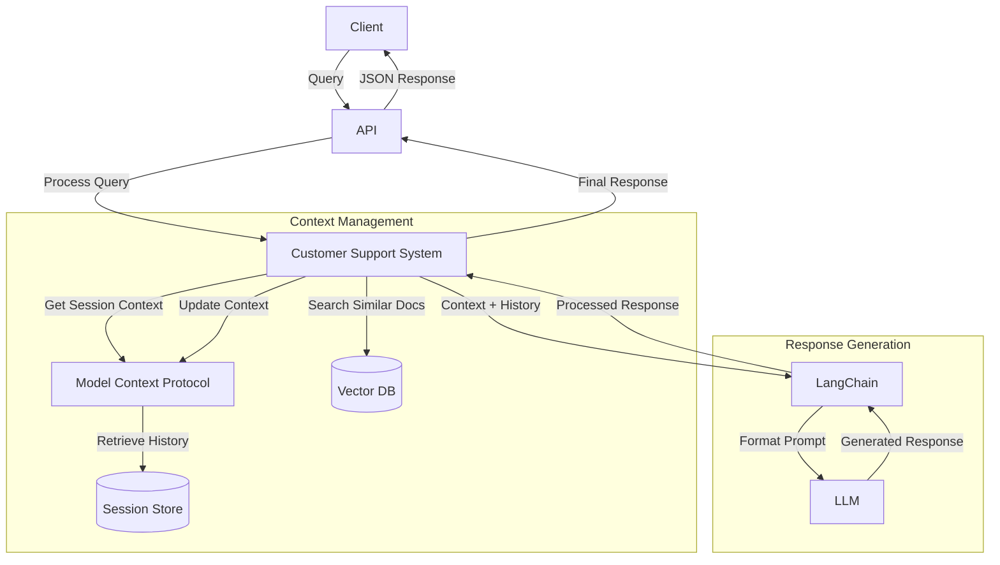

# Building a Context-Aware Customer Support System with LLM, LangChain, Vector Database, and MCP

## Introduction

Picture this: It's 3 AM, and somewhere in the world, a trader is staring at their screen, frustrated because their payment didn't go through. They need help, and they need it now. But your support team? They're only human, and they need sleep (trust me, I've been there!).

This was the reality we faced at our trading platform. Sure, we could've thrown more people at the problem or used a basic chatbot that spits out canned responses. But anyone who's ever rage-quit a conversation with a bot that keeps suggesting to "turn it off and on again" knows that's not the answer.

So, we decided to build something different. Something that actually understands what users are asking about and remembers the conversation context - you know, like a real human would. Today, I'm going to share how we did it using some pretty cool tech: Large Language Models (LLMs), Vector Databases, and something we call the Model Context Protocol (MCP). Don't worry if these sound intimidating - I promise to make this fun!

## The Challenge

Let me paint you a picture of what we were dealing with:

Imagine you're running a global trading platform. Every minute of every day, someone somewhere is trying to deposit money, withdraw their earnings, or figure out why their payment got stuck. Your support team is drowning in questions like:
- "Why did my card payment fail?" (Could be one of a dozen reasons)
- "Where's my bank transfer?" (It's complicated, trust me)
- "Why is my e-wallet transfer taking so long?" (A story for another day)

And here's the kicker - these aren't simple yes/no questions. Each case is unique, often requiring context from previous conversations, understanding of various payment methods, and knowledge of different banking systems across the globe.

We tried traditional chatbots. You know the type - the ones that make you want to throw your keyboard out the window because they keep suggesting irrelevant solutions from their pre-written script. Yeah, those weren't cutting it. We needed something smarter, something that could actually understand the nuances of each situation.

## The Solution: A Robot Support Team

Before diving into the technical details, let's understand how our system works using a simple analogy. Think of it as a team of specialized robots working together:

- A Librarian (Vector Database) who quickly finds relevant documentation
- A Smart Helper (LLM) who reads and answers questions
- A Secretary (MCP) who remembers conversation history
- A Manager (LangChain) who coordinates everyone's efforts

### Here's a Real Example:

```
Customer: "Why did my card payment fail?"

1. Secretary checks: "This is a new customer asking about card payments"
2. Librarian finds: Documentation about card payment failures
3. Helper responds: "There could be several reasons:
   - Insufficient funds
   - Incorrect card details
   - Card expiration
   Let me know which applies to you!"
4. Secretary notes: "Customer inquired about card payments"

Customer: "How do I fix the expired card issue?"

Now the system:
1. Secretary recalls: "Ah, they were discussing card payments!"
2. Librarian locates: Specific information about expired cards
3. Helper provides contextual response: "Since you mentioned expired cards, here's how to fix it:
   - Update your card details
   - Enter the new expiry date
   - Retry the payment"
```

## System Architecture

Before diving into the implementation details, let's visualize how our system processes requests:



This diagram shows how:
1. Client queries enter through our API endpoint
2. The Customer Support System coordinates with various components
3. Context Management handles session history and document retrieval
4. Response Generation creates contextually relevant answers
5. The final response flows back to the client

## Technical Implementation

Now comes the fun part - let's peek under the hood! I'll walk you through how we built this thing, piece by piece. Don't worry if you're not familiar with all the tech - I'll explain everything in plain English, with code snippets for those who want to get their hands dirty.

### 1. The Librarian's Brain: Vector Database (Qdrant)

Remember our librarian analogy? Here's how we gave our librarian a photographic memory using Qdrant. Instead of just remembering keywords, it understands the meaning behind documents - pretty neat, right?

```python
from qdrant_client import QdrantClient
from qdrant_client.models import Distance, VectorParams, Record

class VectorStore:
    def __init__(self, config: Config):
        self.client = QdrantClient(host=config.QDRANT_HOST, port=config.QDRANT_PORT)
        self.embedding_model = SentenceTransformer(config.EMBEDDING_MODEL)

        # Initialize collection if it doesn't exist
        self._init_collection()

    def _init_collection(self):
        collections = self.client.get_collections().collections
        if not any(c.name == self.config.COLLECTION_NAME for c in collections):
            self.client.create_collection(
                collection_name=self.config.COLLECTION_NAME,
                vectors_config=VectorParams(size=768, distance=Distance.COSINE)
            )

    def add_documents(self, documents: List[Dict[str, Any]]):
        embeddings = self.embedding_model.encode([doc["content"] for doc in documents])

        records = [
            Record(
                id=idx,
                vector=embedding.tolist(),
                payload=doc
            ) for idx, (doc, embedding) in enumerate(zip(documents, embeddings))
        ]

        self.client.upload_records(
            collection_name=self.config.COLLECTION_NAME,
            records=records
        )

    def search(self, query: str, limit: int = 5) -> List[Dict[str, Any]]:
        query_embedding = self.embedding_model.encode(query)
        results = self.client.search(
            collection_name=self.config.COLLECTION_NAME,
            query_vector=query_embedding.tolist(),
            limit=limit
        )
        return [hit.payload for hit in results]
```

What's cool about this implementation is that it:
- Sets up its own filing system (collections) if it doesn't exist yet
- Converts documents into a format it can understand (vector embeddings)
- Processes documents in batches for speed
- Actually understands what documents mean, not just what they say

Think of it like this: instead of just matching keywords like "payment" and "failed", it understands that "my transaction didn't go through" means the same thing. Pretty smart for a librarian, right?

### 2. The Secretary's Notebook: Model Context Protocol (MCP)

Ever had to repeat yourself to a support agent because they forgot what you just said? Yeah, we hate that too. Here's how we gave our system a memory that never fails:

```python
class ModelContextProtocol:
    def __init__(self):
        self.conversations: Dict[str, Conversation] = {}

    def add_message(self, session_id: str, role: str, content: str) -> None:
        self.create_session(session_id)
        self.conversations[session_id].messages.append(
            Message(role=role, content=content)
        )

    def get_context(self, session_id: str, max_messages: int = 10) -> List[Message]:
        if session_id not in self.conversations:
            return []
        return self.conversations[session_id].messages[-max_messages:]
```

MCP maintains conversation history and context, ensuring our responses are relevant to the ongoing discussion. It's like having a perfect memory of every customer interaction.

### 3. The Manager's Playbook: LangChain Integration

Remember our manager who coordinates everything? That's LangChain's job. It's like the conductor of an orchestra, making sure everyone plays their part at the right time:

```python
class PaymentSupportChain:
    def __init__(self, config: Config):
        # Set up our smart helper (LLM)
        self.llm = Ollama(
            base_url=config.OLLAMA_BASE_URL,
            model=config.LLM_MODEL
        )

        # Create the script for our assistant
        self.prompt = PromptTemplate(
            input_variables=["context", "conversation_history", "question"],
            template="""You are a helpful payment support assistant...
            Context: {context}
            Conversation History: {conversation_history}
            Question: {question}
            """
        )
```

Think of LangChain as the glue that holds everything together. It makes sure our librarian's knowledge, secretary's notes, and helper's responses all work in harmony. Pretty cool, right?

### 4. The Smart Helper: Llama 2 via Ollama

Now, here's where it gets really interesting. Instead of relying on expensive, cloud-based AI services, we're running Llama 2 right on our own machines. Why? Well:
- We keep complete control (no mysterious black boxes here!)
- Your data stays private (what happens in Vegas...)
- No surprise bills at the end of the month
- Works on both your beefy gaming PC or that old laptop in the corner

## Putting It All Together: The Power of Docker

You know how frustrating it is when someone says "it works on my machine"? Yeah, we hate that too. That's why we containerized everything with Docker. It's like packing each component into its own perfectly organized suitcase:

```yaml
services:
  app:
    build: .
    environment:
      - QDRANT_HOST=qdrant
      - OLLAMA_BASE_URL=http://ollama:11434
    volumes:
      - app_data:/app/data
    depends_on:
      - qdrant
      - ollama

  qdrant:
    build:
      context: .
      dockerfile: Dockerfile.qdrant  # Custom build with health check support
    volumes:
      - qdrant_storage:/qdrant/storage

  ollama:
    build:
      context: .
      dockerfile: Dockerfile.ollama  # Custom build with network utilities
    volumes:
      - ollama_models:/root/.ollama

volumes:
  qdrant_storage:
    driver: local
  ollama_models:
    driver: local
  app_data:
    driver: local
```

### Custom Container Configurations

1. **Ollama Container**
   We've customized the ollama container to include essential network utilities:
   ```dockerfile
   FROM ollama/ollama
   RUN apt-get update && apt-get install -y \
       curl \
       netcat \
       iputils-ping \
       && rm -rf /var/lib/apt/lists/*
   ```
   This ensures reliable health checks and enables network diagnostics, addressing known issues with the base image (see [ollama/ollama#5389](https://github.com/ollama/ollama/issues/5389)).

2. **Qdrant Container**
   Our custom Qdrant container includes necessary utilities for health monitoring:
   ```dockerfile
   FROM qdrant/qdrant
   RUN apt-get update && apt-get install -y \
       curl \
       && rm -rf /var/lib/apt/lists/*
   ```

3. **Data Persistence**
   We use named volumes for reliable data persistence:
   - `app_data`: Stores generated documentation and queries
   - `qdrant_storage`: Maintains vector database data
   - `ollama_models`: Persists downloaded LLM models

## Why It's Awesome

Let me tell you why this system is a game-changer:

1. **It Actually Gets You**: Unlike those annoying chatbots that make you repeat yourself, our system remembers your conversation and understands context. It's like talking to a support agent who's been following your case from the start.

2. **Smart Search That Actually Works**: Ever tried searching for something but didn't use the exact keywords? No problem! Our system understands what you mean, not just what you say. It's like having a librarian who knows exactly which book you need, even if you describe it vaguely.

3. **Your Data Stays Home**: Everything runs on your own machines. No sending sensitive data to the cloud, no privacy concerns, and hey - it's pretty fast too since everything's local!

4. **Grows With You**: Thanks to Docker, scaling up is as easy as copying and pasting (well, almost). Whether you're handling 10 or 10,000 queries, the system's got you covered.

## Want to Try It Yourself?

Ready to build your own super-smart support system? Let's get you started! Don't worry if you're not a Docker expert - I'll walk you through it:

1. First, grab the code:
   ```bash
   git clone <repository-url>
   cd payment-support-system
   ```

2. Fire up the engines:
   ```bash
   docker compose up -d
   ```
   This starts all our containers - think of it as assembling your robot support team!

3. Load up the brains:
   ```bash
   docker compose --profile init up init-data
   ```
   This is where the magic happens:
   - Your system learns about different support scenarios
   - Builds its smart search capabilities
   - Gets ready to handle real questions

4. Take it for a spin:
   ```bash
   # Ask a simple question
   curl -X POST http://localhost:8000/query \
     -H "Content-Type: application/json" \
     -d '{"query": "Why did my card payment fail?"}'

   # Have a conversation (it remembers context!)
   curl -X POST http://localhost:8000/query \
     -H "Content-Type: application/json" \
     -d '{
       "query": "What should I check first?",
       "session_id": "user123"
     }'
   ```

## The Future is Here (And It's Pretty Cool)

We've built something special here - a support system that actually understands you, remembers context, and gives helpful answers. No more robotic responses or frustrating loops of "I didn't understand that."

The best part? It's all open-source and runs locally. You can take this, customize it, and make it your own. Whether you're handling payment support, customer service, or any other kind of support - this system can adapt.

## Want to Learn More?

Here's where you can dive deeper into each piece of our robot support team:

- 🤖 [Check Out the Complete Code](repository-url) - See how it all comes together
- 🦙 [Meet Llama 2](https://github.com/facebookresearch/llama) - Our smart helper's brain
- 🔗 [LangChain's Playbook](https://python.langchain.com/docs) - How to be a great manager
- 📚 [Qdrant's Library Guide](https://qdrant.tech/documentation) - Building a smart librarian
- 🎯 [Ollama's Toolkit](https://ollama.ai) - Running LLMs locally made easy

Remember: Building great AI systems is like cooking - it's not just about having fancy ingredients, it's about knowing how to mix them together to create something amazing. Now go build something awesome! 🚀
